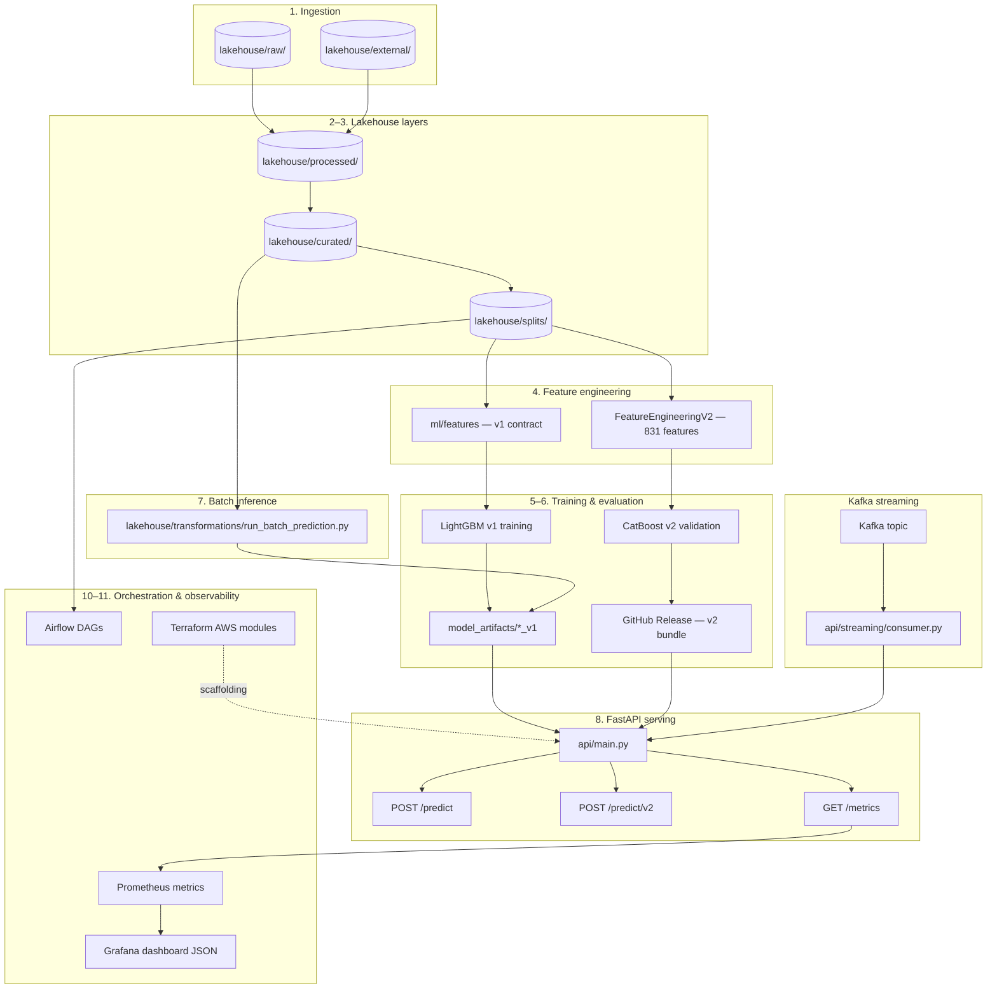

# System Architecture & Data Flow

Contributor-oriented overview of how data and models move through this repository. This document matches **implemented** paths only; for capability status see [README](../README.md#verified-system-architecture) and [repository architecture audit](reports/repository_architecture_and_capability_audit.md).

## High-level flow



## End-to-end stages

| # | Stage | Location / entry point | Notes |
|---|--------|------------------------|-------|
| 1 | Raw ingestion | `lakehouse/raw/`, `scripts/ingest_raw_to_parquet.py` | Immutable source data |
| 2 | Processed layer | `lakehouse/processed/` | Cleaning, typing, normalization — see [data_lakehouse.md](data_lakehouse.md) |
| 3 | Curated & splits | `lakehouse/curated/`, `lakehouse/splits/` | ML-ready tables and train/val splits |
| 4 | Feature engineering | `ml/features/`, `FeatureEngineeringV2` | v1: 445 features; v2: 831 features |
| 5 | Model training | `ml/training/`, notebooks under `notebooks/` | LightGBM v1 + CatBoost v2 validation path |
| 6 | Evaluation & artifacts | `model_artifacts/`, GitHub Release `model-v2-catboost-artifacts-*` | v2 large artifacts **not** in Git |
| 7 | Batch inference | `lakehouse/transformations/run_batch_prediction.py` | Offline scoring |
| 8 | FastAPI serving | `api/main.py` → `ml/inference/predict.py` / `predict_v2.py` | See [api.md](api.md) |
| 9 | Kafka streaming | `api/streaming/consumer.py` | Local consumer posts to `/predict` |
| 10 | Airflow | `airflow/dags/` | Batch/retrain DAG definitions |
| 11 | Monitoring | `/metrics`, `monitoring/grafana/` | Model-aware Prometheus labels |
| — | AWS infra (scaffolding) | `terraform/modules/`, `terraform/environments/dev/` | Not claimed live without deploy evidence |

## Active inference paths

**Model v1 (LightGBM)** — unchanged production path:

```text
POST /predict → FraudPredictor → ml/inference/predict.py
  → model_artifacts/fraud_lgbm_v1.joblib
  → feature_transformer_v1.joblib + feature_columns_v1.json + threshold_v1.json
```

**Model v2 (CatBoost)** — validated candidate:

```text
POST /predict/v2 → FraudPredictorV2 → ml/inference/predict_v2.py
  → model_artifacts/fraud_catboost_v2.joblib (+ v2 transformer, columns, metadata, threshold)
```

## Related documentation

- [Data lakehouse layers](data_lakehouse.md)
- [ML pipeline stages](ml_pipeline.md)
- [API reference](api.md)
- [Local Docker Compose (v2)](local_compose_v2.md)

## What this repo does **not** claim

- Live public AWS deployment without separate validation
- Full CD pipeline (CI only in `.github/workflows/`)
- Agentic AI runtime (planned only)
